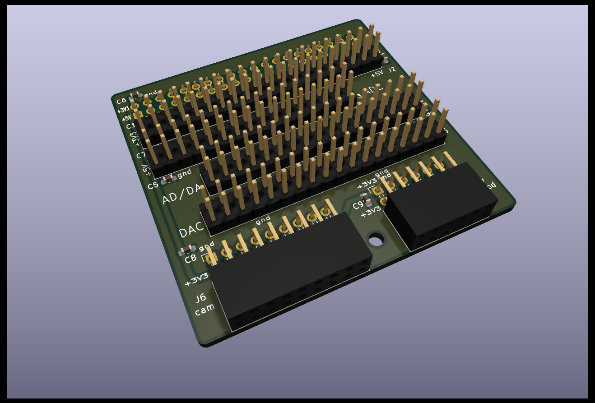
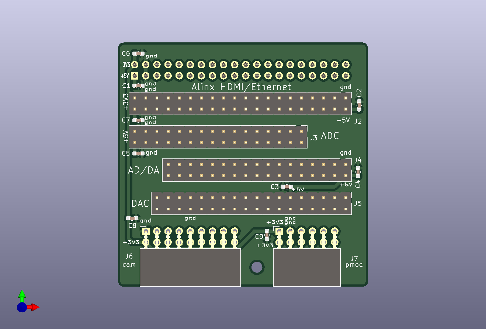
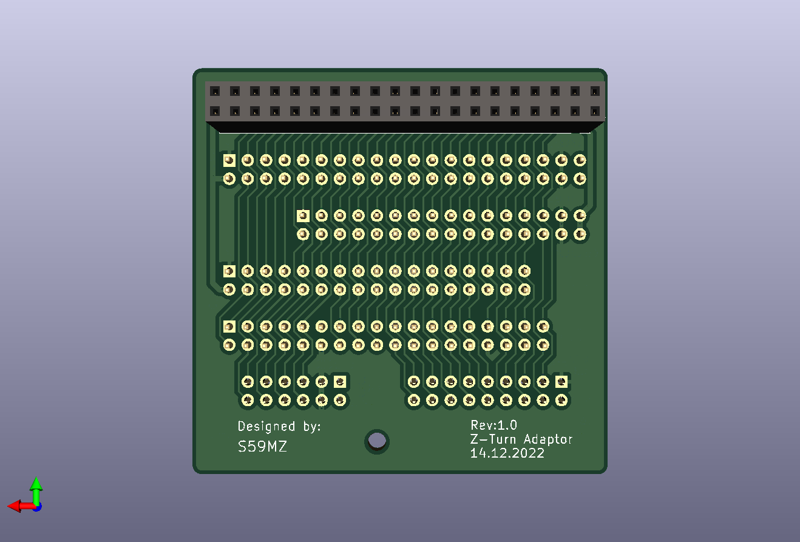

# z_adaptor
Adaptor from Z-Turn I/O Expansion card to several Alinx DAC/ADC, HDMI, Ethernet modules and PMODS

Schematic:
[z_adaptor.pdf](z_adaptor.pdf)

BOM:
[z_adaptor.csv](z_adaptor.csv)

Gerbers:
[gerbers.zip](https://github.com/s59mz/kicad-z_adaptor/raw/main/gerbers.zip)
